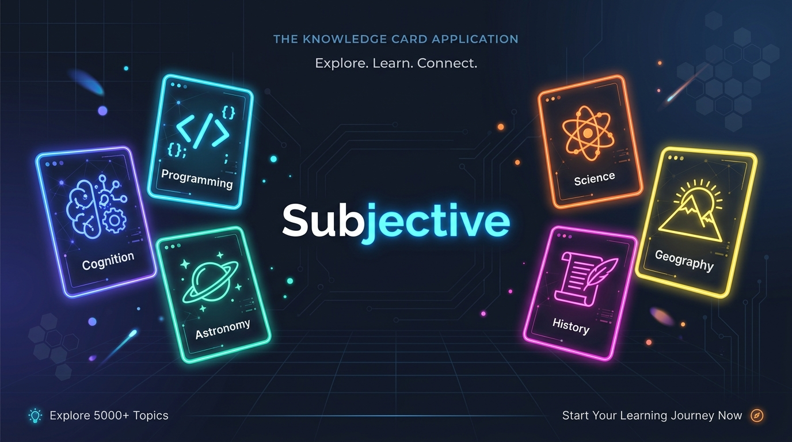
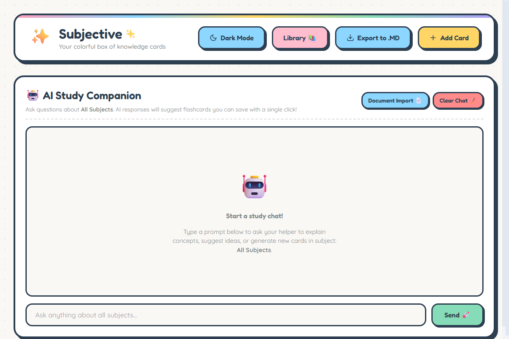
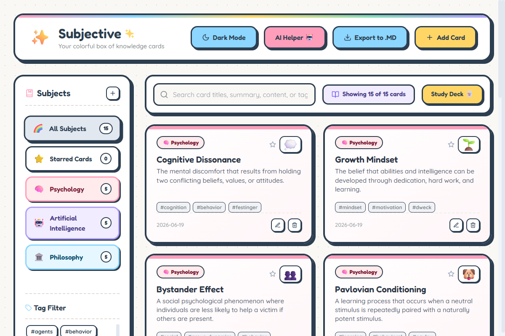

# Subjective 🪐
> Your vibrant, colorful, and intelligent box of knowledge cards.



**Subjective** is a modern, high-performance desktop application built using Electron, React, and Vite. Designed with a bouncy, premium **Neo-Brutalist** aesthetic, it helps you organize, memorize, and create flashcards with an integrated, document-parsing AI companion.

---

## ✨ Features

- 🎨 **Vibrant Neo-Brutalist Design:** Bold colors, thick strokes, and satisfying bounce animations. Supports complete Light and Dark modes.
- 🤖 **AI Study Companion:** Ask your helper to explain concepts, suggest ideas, or generate new decks based on chat history.
- 📄 **Native Document Analyzer:** Convert books (`.pdf`), presentations (`.pptx`), Word files (`.docx`), or plain text (`.txt`/`.md`) into flashcards. 
  - Uses a **native OS file picker** to safely bypass browser-based path sandboxing.
  - Powered by Microsoft's **`markitdown`** package in Python for text extraction.
  - Cross-platform support (automatically maps `python` commands on Windows and `python3` on macOS).
- 🃏 **Study Mode:** Shuffles active decks and opens an interactive 3D flip card system to test your recall with "Got it!" and "Study Again" controls.
- ⭐ **Starred & Favorites:** Toggle stars on cards to automatically compile a virtual **Starred Cards** deck in the sidebar.
- 🏷️ **Dynamic Tag Filters:** Narrow down your list instantly using the tag cloud built right under the subject list.
- 📝 **Markdown rendering:** Enjoy headings, lists, inline code, bold text, and block quotes inside card notes, study screens, and AI chat responses.
- 📤 **Structured Markdown Exports:** Download your entire library grouped by subject and formatted as a single `.md` document.

---

## 🛠️ Installation & Setup

Subjective runs as an Electron app on your local machine.

### Prerequisites
Make sure you have the following installed:
- [Node.js](https://nodejs.org/) (v18+)
- [Python 3](https://www.python.org/) (Required for the Document Analyzer's file parsing engines)

### 1. Clone the repository
```bash
git clone https://github.com/janiceho96/Subjective.git
cd Subjective
```

### 2. Install Node dependencies
```bash
npm install
```

### 3. Install Python dependencies (for Document Analyzer)
The Document Analyzer relies on Python libraries. Install them depending on your OS:

- **Windows:**
  ```bash
  pip install markitdown pypdf python-docx
  ```
- **macOS / Linux:**
  ```bash
  pip3 install markitdown pypdf python-docx
  ```

### 4. Setup API Keys
Subjective uses a local environment file to configure AI services.
Create a `.env` file inside `anti-procrastination-engine/backend/.env` and add your API keys:
```env
ANTHROPIC_API_KEY=your_deepseek_or_anthropic_api_key
ANTHROPIC_BASE_URL=https://api.silra.cn/
```

---

## 🚀 Running the App

### One-Click Launchers
We provide simple launcher scripts to clean up process locks and run the app instantly:
- **Windows:** Double-click the **`start_subjective_app.bat`** file.
- **macOS / Linux:**
  1. Open your terminal in the app directory and make the script executable:
     ```bash
     chmod +x launch.sh
     ```
  2. Launch the script:
     ```bash
     ./launch.sh
     ```

### Manual Dev Launch
```bash
npm run build:vite
npm start
```

---

## 📦 Packaging & Building

To package the application into a standalone installer (e.g. `.exe` for Windows or `.dmg` for Mac):

- **Build for Windows (must run on Windows):**
  ```bash
  npm run build
  ```
  *(Outputs folder and installers inside the `release/` directory)*
- **Build for macOS (must run on Mac):**
  ```bash
  npm run build
  ```
  *(Outputs `.dmg` installer and `.app` bundle inside the `release/` directory)*

---

## 📸 Screenshots

### AI Study Companion & Document Import


### Library Dashboard & Study Cards

